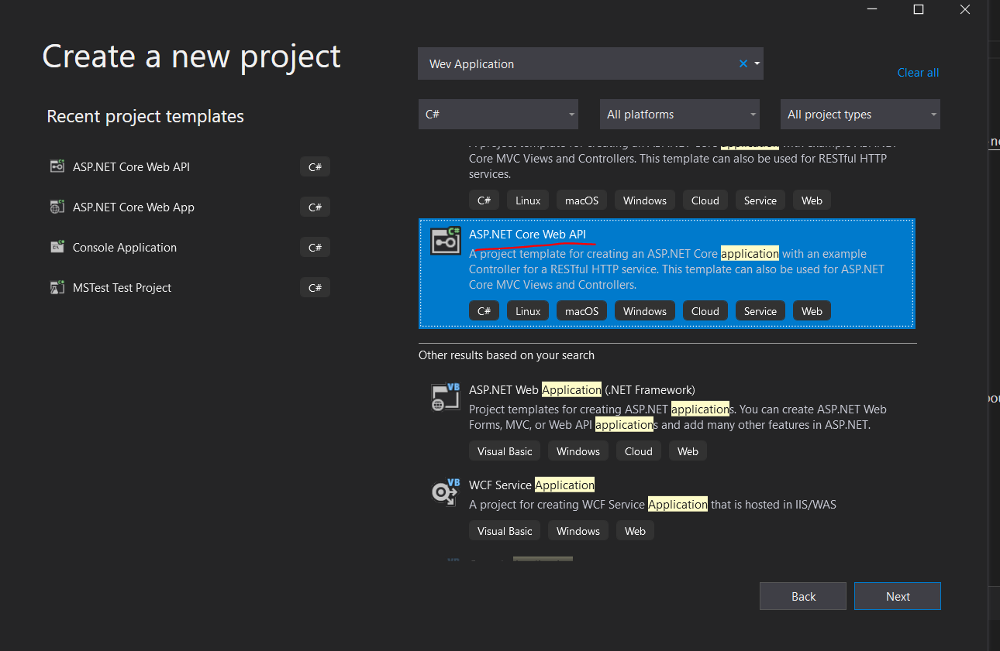

# Async Programming in C#

## Summary
 Christian explains routing and how data is modeled in an ASP.NET Core application. He uses Entity Framework Core for grasping how data models in the project connect to underlying databases. He covers essential topics such as API versioning and CRUD operations

## Estimated Time
The estimated time is more than eight hours.
- Media 3h 10m

## Resources
- LinkedIn Learning - [Async Programming in C#](https://www.linkedin.com/learning/building-web-apis-with-asp-dot-net-core-3/apis-today)
- Postman - [Download Postman](https://www.postman.com/downloads/)

## Directions
Code alongside Christian.  Do each quiz at the end of the chapter.  Everything Christian covers is important, but apprentices are not expected to remember many topics discussed by Christian.  The next lesson and project are simplification and revisit the core concepts.

Previous topics discussed:
- What is an API
- RESTFUL API
- Entity Framework Core
  - Code first approach
- Postman

### Introduction

### Getting Started
- Skip instructions for installing Visual Studio.
- Select *ASP.NET Core Web API* instead of *ASP.NET Core Web Application.*  The GUI for selecting a project has been simplified into a single step.  The template is the same.  Either a .NET Core 3.1 or .NET 5.0 will work.

- **You may select *yes* for trusting the *IIS Express SSL certificate*.** This will stop the browser warnings about unsafe connections.
- **Watch** the set up for Visual Studio Code.
- Optionally skip the chapter *"Hello World" with Visual Studio Code.*  
**Download Postman for testing your API** - https://www.postman.com/downloads/.  It is not recommended to download Fiddler.

### Retrieving Data
- Follow Christian for creating a new Project through Visual Studios
- You may follow the instructions for installing packages via the command line.
- Although Christian shows us returning IEnumerable almost always you will be returning IAction result.

### Advanced Data Retrieval

### API Versioning
This is the least important chapter, but Christian forces us to review our code, introduces versioning, and working with middle wear, and more information in headers.

**STOP HERE**
### Securing APIs
**You may skip chapter six on securing APIs**

### Conclusion